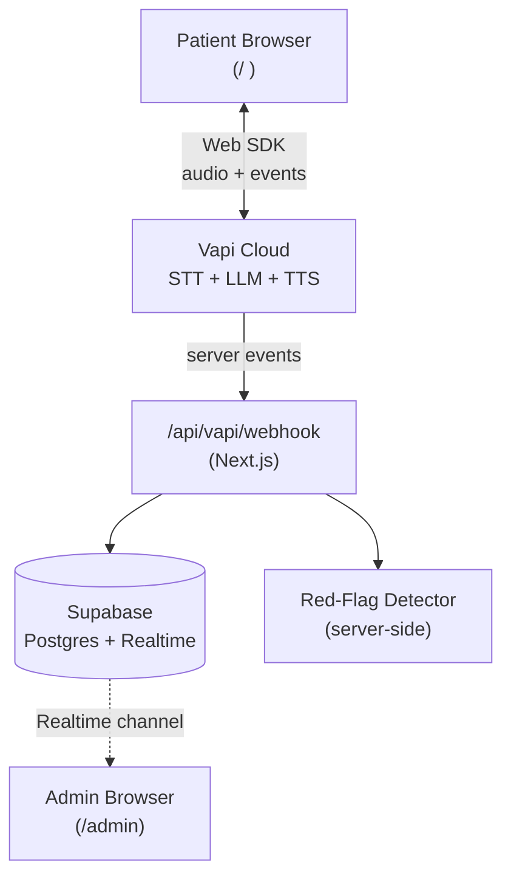
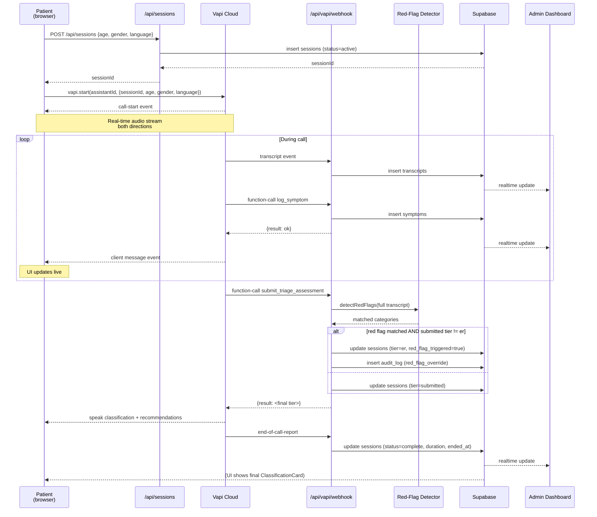

# Architecture

## Goals

1. A patient can complete a triage interview without typing — voice only, browser only
2. Every classification is auditable and overridable by a server-side safety layer
3. Both surfaces (patient + admin) stay in sync in real time
4. Demo runs entirely in a browser on the projector — no phones, no telephony

## System diagram

## Sequence — one triage session

## Why two dashboards

The patient flow is the **demo moment** — voice call, live transcript, classification card. It must be polished, anonymous, and self-explanatory.

The admin dashboard is the **product proof** — it shows judges that this isn't a toy. It demonstrates: real data persistence, audit logging, real-time staff coordination, and the red-flag override mechanism in action. It's also where the rubric's "Clinical Decision Support" framing gets its strongest signal.

One app, two routes, shared backend, shared realtime channel.

## Data flow choices

- **Patient UI updates from Vapi client events, not Supabase.** Lower latency, no double-write race conditions. The webhook persists in parallel for the admin side.
- **Admin UI updates from Supabase Realtime, not Vapi.** The admin never holds Vapi credentials in the browser, and Supabase Realtime is purpose-built for this fan-out.
- **`sessionId` is the join key.** Created server-side, passed to Vapi as a variable override at call start, echoed back on every webhook event.

## Red-flag override layer

The single most important safety mechanism. Lives at `src/lib/red-flags.ts`. Invoked inside the `submit_triage_assessment` webhook handler.

**Inputs:** the concatenated `transcripts.content` for the session, ordered by `created_at`.

**Process:**
1. Tokenize transcript, lower-case, strip punctuation
2. For each red-flag category (see `docs/red-flags.md`), scan for member keywords/phrases
3. For each match, look backward up to 3 tokens for negation markers (`no`, `not`, `denies`, `without`, `negative for`, `ruled out`)
4. Discard negated matches
5. Return array of matched categories

**Decision rule:**
- If `matched.length > 0` AND `submittedTier ∈ {home, clinic}` → override to `er`, log to `audit_log`
- Otherwise → accept the LLM's tier

**Why this matters in Q&A:** Every judge will ask "what if it misclassifies an MI as home care?" Your answer is the red-flag layer. It is hard-coded, server-side, and the LLM cannot influence it. The audit log proves every override that has ever happened.

## Required disclaimer wording

Show before the call starts (gate the **Start Triage Call** button behind a consent checkbox) and on the final classification card.

> **This is an AI triage assistant, not a diagnostic tool.** It does not replace consultation with a licensed medical professional. The recommendations provided are based on the information you share and are intended only to help you decide what level of care to seek. If you believe you are experiencing a medical emergency, call emergency services (108 in India) immediately. Your conversation will be logged for quality and audit purposes.

Do not paraphrase this on the patient-facing UI. Use it verbatim.

## Privacy posture

- No account required on the patient side
- Age and gender are optional self-reported fields
- Transcripts are stored to enable admin review and red-flag auditing — this is disclosed in the disclaimer
- Service role keys are server-only
- No third-party analytics, no PII forwarding
- For production: add RLS, encrypt transcripts at rest, add retention policy, signed admin access only

## Tradeoffs taken (and what we'd change for production)

| Hackathon choice | Production change |
|---|---|
| Service role key in webhook | RLS + per-session JWT |
| Vapi assistant in dashboard | Assistant config in code, version-controlled, deployed via Vapi API |
| Anonymous patient side | Optional sign-in for return visits + history |
| Red-flag list in code | Curated by clinical advisors, externalized to DB with versioning |
| Single locale (en + hi toggle) | Full multilingual STT/TTS + cultural calibration |
| In-memory rate limits | Proper rate limiter (Upstash) + abuse detection |
| Self-hosted webhook only | Dead-letter queue + retry policy + observability (Sentry, OpenTelemetry) |
